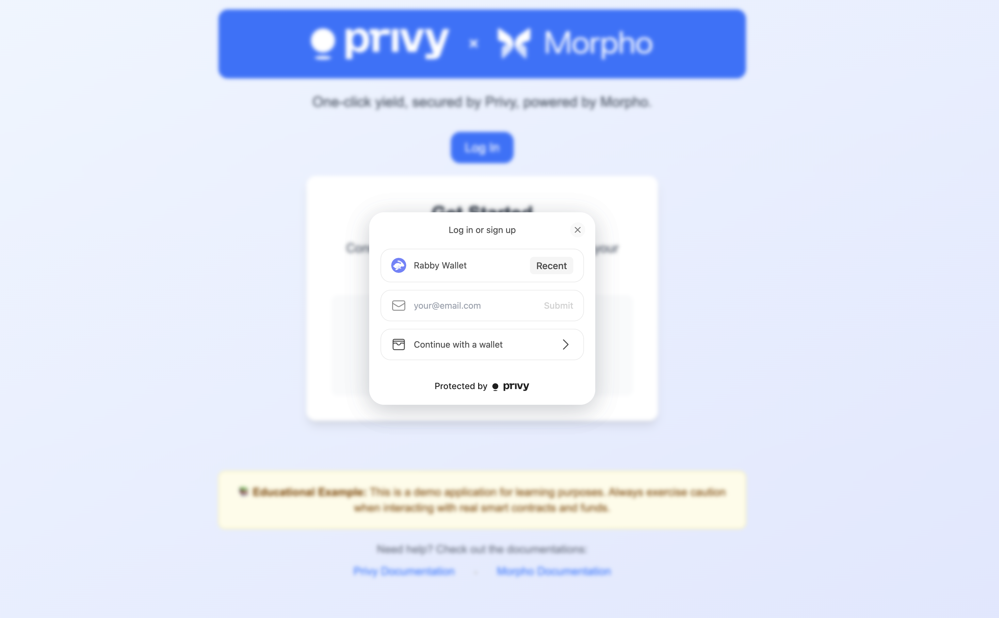

# Privy × Morpho: DeFi Yield Integration Demo

A comprehensive example demonstrating how to integrate **Privy's embedded wallets** with **Morpho Vaults** to enable seamless DeFi yield generation for your users.

## 🚨 Disclaimer

This repository is an **educational demonstration** designed to showcase integration patterns between Privy and Morpho protocols. While the code is functional, it is intended for learning purposes and should **not be used in production without proper security audits, testing, and risk assessment**.

**⚠️ Important Notes:**
- This facilitates the Privy-Morpho integration for educational purposes
- Always exercise caution when interacting with real smart contracts and funds
- Conduct thorough testing on testnets before mainnet deployment
- Consider professional security audits for production applications

## 📋 Table of Contents

- [Overview](#-overview)
- [Prerequisites](#-prerequisites)
- [How It Works](#-how-it-works)
- [Key Integration Considerations](#-key-integration-considerations)
- [Screenshots](#-screenshots)
- [Technical Implementation](#-technical-implementation)
- [Security Considerations](#-security-considerations)
- [Extensibility](#-extensibility)
- [Resources](#-resources)
- [Getting Started](#-getting-started)
- [License](#-license)

## 🎯 Overview

This project demonstrates how to build a **one-click DeFi yield application** that combines:

- **[Privy](https://privy.io)**: Embedded wallet infrastructure for seamless user onboarding
- **[Morpho](https://morpho.org)**: Automated yield optimization across lending markets
- **Base Network**: Layer 2 solution for cost-effective transactions

The goal is to highlight **Earn recipes** that developers can leverage when integrating Morpho vaults with Privy's wallet infrastructure, enabling users to earn yield on their crypto assets with minimal friction.

### Key Features

- 🔐 **Privy Authentication**: Social login, email, or wallet connection
- 💰 **USDC Vault Integration**: Deposit into Morpho's yield-generating vaults
- 📊 **Real-time Data**: Live vault metrics via Morpho's GraphQL API
- 🔄 **Full Cycle**: Approve, deposit, track, and withdraw functionality
- 📱 **Responsive UI**: Modern, intuitive interface for DeFi interactions

## 📚 Prerequisites

Before implementing this integration, ensure you have:

- **Node.js 18+** and **npm/yarn**
- **Privy App ID** from the [Privy Dashboard](https://dashboard.privy.io)
- **Base Network** understanding (Layer 2 Ethereum)
- **Basic DeFi knowledge** (ERC-20 tokens, vault concepts)
- **USDC on Base** for testing functionality

## 🔧 How It Works

### 1. **User Authentication**
- Users connect via Privy's embedded wallet system
- Supports email, social login, or external wallet connection
- Automatic wallet creation and management

### 2. **Vault Integration**
- Connects to Morpho's **Steakhouse USDC Vault** on Base
- Implements ERC-4626 standard for vault interactions
- Real-time price and APY data via GraphQL API

### 3. **Transaction Flow**
```
User Login → Approve USDC → Deposit to Vault → Earn Yield → Withdraw
```

### 4. **Smart Contract Interactions**
- **ERC-20 Approval**: Grant vault permission to transfer USDC
- **Vault Deposit**: Convert USDC to vault shares
- **Balance Tracking**: Monitor user's vault positions
- **Withdrawal**: Redeem shares back to USDC

## ⚠️ Key Integration Considerations

### For Privy Integration:

1. **Wallet Management**
   - Handle multiple wallet types (embedded, external)
   - Implement proper wallet switching for Base network
   - Manage wallet connection states gracefully

2. **Transaction Handling**
   - Use `encodeFunctionData` for contract interactions
   - Handle gas estimation and transaction confirmation
   - Implement proper error handling for failed transactions

3. **User Experience**
   - Provide clear feedback during transaction processing
   - Show meaningful error messages for common issues
   - Implement loading states and transaction status updates

### For Morpho Integration:

1. **Vault Selection**
   - Choose appropriate vaults based on risk/reward profile
   - Verify vault legitimacy and curator reputation
   - Monitor vault capacity and liquidity constraints

2. **ERC-4626 Compliance**
   - Understand the difference between `deposit/mint` and `withdraw/redeem`
   - Handle share price fluctuations correctly
   - Account for potential slippage in vault operations

3. **Data Fetching**
   - Use Morpho's GraphQL API for real-time vault data
   - Implement proper error handling for API failures
   - Cache data appropriately to avoid rate limiting

## 📸 Screenshots

### Log In:


Click on the Log In button, 

### Select your privy authentification method


### Play with Morpho Vaults


## 🛠️ Technical Implementation

### Core Components

1. **`MorphoVaultComponent.tsx`**
   - Main vault interaction interface
   - Handles deposits, withdrawals, and balance checking
   - Integrates with Morpho's GraphQL API

2. **`constants.ts`**
   - Contract addresses and ABIs
   - Chain configuration
   - Token decimal settings

3. **`utils.ts`**
   - Formatting functions for amounts and addresses
   - BigInt handling utilities
   - Transaction URL generation

### Key Functions

```typescript
// Deposit USDC into Morpho Vault
const handleDeposit = async () => {
  const amount = parseUsdcAmount(depositAmount);
  const data = encodeFunctionData({
    abi: MORPHO_VAULT_ABI,
    functionName: 'deposit',
    args: [amount, wallet.address]
  });
  // Execute transaction...
};

// Withdraw from vault
const handleWithdraw = async () => {
  const data = encodeFunctionData({
    abi: MORPHO_VAULT_ABI,
    functionName: 'redeem',
    args: [shares, wallet.address, wallet.address]
  });
  // Execute transaction...
};
```

### Integration Pattern

```typescript
// 1. Initialize Privy
const { ready, authenticated, user } = usePrivy();

// 2. Get wallet provider
const provider = await wallet.getEthereumProvider();

// 3. Switch to Base network
await wallet.switchChain(BASE_CHAIN_ID);

// 4. Execute contract interaction
const hash = await provider.request({
  method: 'eth_sendTransaction',
  params: [{ from: wallet.address, to: CONTRACT_ADDRESS, data }]
});
```

## 🔒 Security Considerations

### Smart Contract Risks
- **Vault Security**: Morpho vaults are subject to smart contract risks
- **Approval Management**: Unlimited approvals pose potential security risks
- **Network Risks**: Base network and bridge security considerations

### Integration Security
- **Input Validation**: Sanitize all user inputs and amounts
- **Error Handling**: Implement comprehensive error catching
- **State Management**: Prevent race conditions in transaction handling

### Best Practices
- **Testing**: Thorough testing on testnets before mainnet
- **Monitoring**: Implement transaction monitoring and alerting
- **Updates**: Keep dependencies and contracts updated

## 🌐 Extensibility

### Multi-Chain Support
This integration pattern can be extended to **any chain where Morpho is supported**:

- **Ethereum Mainnet**: Original Morpho deployment
- **Base**: Current implementation (Layer 2)
- **Future Chains**: Easily adaptable to new Morpho deployments

### Vault Flexibility
**Any Morpho vault** can be integrated by:

1. **Updating Contract Address**: Change `MORPHO_VAULT_ADDRESS` in constants
2. **Adjusting Asset Configuration**: Update token addresses and decimals
3. **Modifying Chain Settings**: Update `BASE_CHAIN_ID` and explorer URLs

### Example Extension
```typescript
// Add new vault support
const WETH_VAULT_ADDRESS = '0x...'; // Different vault
const WETH_ADDRESS = '0x...'; // Different asset
const ARBITRUM_CHAIN_ID = 42161; // Different chain
```

## 📖 Resources

### Documentation
- **[Privy Documentation](https://docs.privy.io/basics/get-started/about)**: Complete integration guide
- **[Morpho Documentation](https://docs.morpho.org)**: Protocol overview and API reference
- **[Privy Swap Recipe](https://docs.privy.io/recipes/swap-with-0x)**: Additional integration patterns

### APIs and Tools
- **[Morpho GraphQL API](https://api.morpho.org/graphql)**: Real-time vault data
- **[Morpho App](https://app.morpho.org)**: Vault discovery and analytics
- **[Base Documentation](https://docs.base.org)**: Layer 2 network details

### Community
- **[Privy Discord](https://discord.gg/privy)**: Developer support and discussions
- **[Morpho Discord](https://discord.gg/morpho)**: Protocol updates and community

## 🚀 Getting Started

### 1. Clone and Install
```bash
git clone <repository-url>
cd privy-earn-app
npm install
```

### 2. Environment Setup
```bash
# Create .env.local
NEXT_PUBLIC_PRIVY_APP_ID=your_privy_app_id
```

### 3. Run Development Server
```bash
npm run dev
```

### 4. Test the Integration
- Connect wallet via Privy
- Ensure Base network connection
- Test with small USDC amounts first

## 📄 License

This project is licensed under the MIT License - see the [LICENSE](LICENSE) file for details.

---

**Built with ❤️ to demonstrate the power of Privy × Morpho integration**

*Remember: This is an educational demonstration. Always conduct proper due diligence and testing before deploying to production.*
